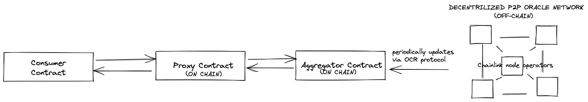
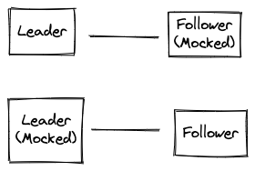
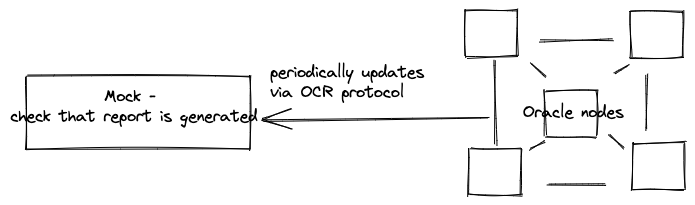

## Data Feed High Level Architecture

# Test Approach
We will be adopting a proactive and risk-based testing approach, as well as we will try shift testing left as much as possible.

**Proactive** — This means that the test design process is initiated as early as possible in order to find and fix the defects before the build is created.
Here we imply qa of requirements and specs readiness,  Of ten Was can help translate clients requirements to devs.

**Shift Left test approach** - practice intended to find and prevent defects early in the software delivery process

**Risk-based** — This means that we will organize our testing efforts in a way that reduces the level of product risk when the system ships.
Risk-based testing uses risk to prioritize and emphasize the appropriate tests during test execution.

**Main Points:** 
* Tests for a feature are automated as part of Definition of Done of this feature (e.g. User Story) and executed in CI/CD system
  1. on Pull Requests of short-lived feature branches first
  2. merging a feature to master branch (trunk)
  3. after deployment to test env
  4. or on demand or scheduled basis if for example not possible to achieve fast feedback loop from test execution due to big number of tests
* In case when SUT has functionality that has not been covered by tests, then prioritization of the test cases needs 
to take place and introduce automation of these tests as part of delivery.
* 'Testing pyramid' concept is followed
* Test automation goal is to have compact, sufficient and manageable set of tests to ensure good enough test coverage. 
Generic approach is to get more test coverage on the lower levels, which are faster to execute and allow more quick diagnosis of
the issues and defects
* Test that can't be automated should be recorded and stored for future manual regression runs.
* 'Zero tolerance to failures' approach is practiced
* Failed tests are analysed for the failure reason on constant basis
* Tests are constantly maintained to ensure, that they are in sync with application and produce valid results
* Manual exploratory testing on the deployed application is done to cover additional quality risks
* All tests (unit, integration, system) are stored together with application code. 
Since codebase is versioned together with the tests and tests should run on every commit to trunk, then we can achieve releasing services independently which is one of the main problems in microservices realm where integration testing between services is key

## Definition of Done of Developed Functionality
* Functionality is documented, reviewed and acceptance criteria(s) defined
* Code developed, unit/integration/e2e tests created
* Code review performed and feedback incorporated
* Code pushed to GIT and deployed to DEV/STG/(maybe even PROD if we follow full Continues Deployment model) environment
* Tests designed, prioritised, automated and are passing
* Feature has been reviewed by BA

## Scope and Levels of Testing
## Functional Testing
### Unit Testing
* Scope - 
  * for the Off-Chain Oracle Network - testing of individual low level components (e.g. methods with crucial logic)
  However, I would not put much emphasis on unit testing when testing protocols, 
  since in this case we need to verify how distributed system works.
  * for Smart Contracts - need to test each smart contract (Consumer, Proxy and Aggregator) in isolation (e.g. with Hardhat, Waffle and Ethers.js)

### Protocol Integration Testing:
Can be divided into 2 categories - 
#### 1. testing each node with different roles in isolation - Leader and Follower

What can be tested for each role:

**Leader**: 
* initiates process by broadcasting to all followers
* verifies and stores observations from followers
* assembles final report

**Follower**:
* follower makes observation, signs it and sends to leader
* follower verifies, compresses amd signs sorted report
* follower broadcasts

#### 2. testing each protocol (Pacemaker, Report Generation and Transmission) as a black box

This ensures that we follow shift-left testing approach which in turn will end up in having faster feedback loop from the tests. 

#### Test Scenarios:
1. **Pacemaker** - 
   1. check that the protocol drives report generation 
   2. check Byzantine Fault Tolerance (check timeout for the leader's performance, if timeout is exceeded,
   then check oracle then moves to initiate a new epoch with another report generation protocol instance and a different leader )
   3. check Changing Leader process 
   4. Negative Scenario: abort the currently running report generation instance if _Leader_ does not observe enough progress

2. **Report Generation**
   1. test - A new epoch should be started whenever a sufficient number of oracles have
      determined that a new leader is needed
   2. check that Leader controls rounds 
   3. check signatures 

3. **Transmission**:
   1. check that final report is sent to smart contract

### System test (E2E):
In E2E test I would focus our main risk test scenarios.

Lets identify main goals of the System Under Test (SUT):
> #### OCR Protocol Design Goals
> * **Resilience**: The protocol should be resilient to different kinds of failures. Oracles may become Byzantine out
  of malice or due to buggy code. The chosen security model limits only the number of faulty oracles, not
  the types of faults.
> * **Simplicity**: We will implement and maintain this design, and wish to ship quickly to meet growing market
  demand, while supporting continual future improvements. We thus follow the KISS principle.
> * **Low transaction fees**: Communication between the oracles and computation performed by the oracles happens off-chain and is therefore (almost) free.
> * **Low latency**: We want to minimize the time between the initiation of the signing protocol and the inclusion of
  the resulting transaction on the blockchain by smart contract.

* Latency can be covered by Performance tests. 
* Resilience can be covered by E2E tests. One of the main 

Participants of the decentralized system need to regularly agree on the current state and this is called _"Consensus Achievement"_. 
However, reaching consensus on distributed systems in a safe and efficient way is not an easy task since there is possibility that some of the nodes will fail or act maliciously. 
Hence, we need to test OCR protocol for [Byzantine Fault Tolerance](https://academy.binance.com/en/articles/byzantine-fault-tolerance-explained)

Let's derive scenarios for covering such case:
1. Test with faulty node -
    1. node should provide incorrect data (that is quite different from other nodes) - node's observations should not be taken into account
2. lets have 5 nodes
   1. remove 3 nodes - should stop working as OCR requires at least 3 (?) honest nodes to operate
   2. remove 2 nodes - should continue working
3. testing fallback - simulate network failure for all nodes and check that fallback occurs to FluxMonitor protocol?
4. Test Byzantine-faulty and benign faulty nodes 
> (f < n/3 but f + c ≥ n/3 at any point in time during the
   protocol execution, then: (a) the protocol may lose liveness, but (b) always satisfies the safety properties.)
5. check that benign faults are permitted by the system 
> A correct node may crash and become unresponsive for some time or it may become unreachable from some
   or all other correct nodes (as if during a network partition). When the node resumes operation after recovering,
   it restores some state from local persistent storage and will participate in the protocol again correctly. A benign
   fault is transient and must never influence the safety of the protocol.
6. verify timeouts - node should nto respond with timeout configuration time, verify that node is marked as benign or faulty

#### E2E Scenario for Off-Chain Oracle Network:

1. Verify that protocol repeatedly produce reports which are recorded by the smart contract on Ethereum blockchain
2. A Report is signed by sufficiently many oracles
   and consists of a sorted list with recent observations from a plurality of oracles.
3. The report is submitted to smart contract
   The code of smart contract, in turn,
    1. verifies the signatures,
    2. checks that the list of observations is sorted,
    3. records which oracles contributed,
    4. stores the median of the observations as the reported value on the blockchain
4. The contributing oracles receive a payout.

* Check **_Deviation Threshold_** or **_Heartbeat Threshold_** settings are followed
* test Timing model? -  
> Formally, partial synchrony means that the network is asynchronous and the clocks of the nodes are not
   synchronized up to some point called global stabilization time (GST). After GST, the network behaves synchronously, the clocks behave synchronously, and all messages between correct nodes are delivered within
   some bounded delay ∆, and this remains so for the remainder of the protocol execution. In practice, a protocol
   may alternate multiple times between asynchronous and synchronous periods. Liveness is only ensured for
   periods of synchrony
* check Consumer, Proxy, Aggregator contracts and the Oracle Decentralized Network working together

#### Scenario for FULL E2E (Black Box):
We need to verify our code on a live testnet network since we need to ensure how everything works with a Smart Contract covering full e2e journey.
This should be a Black Box test where we need to verify:
1. Consumer Contract receives report 
2. Report is regenerated after **_Deviation Threshold_** or **_Heartbeat Threshold_**

#### Tools:
[Example](https://github.com/smartcontractkit/chainlink/blob/develop/integration-tests/smoke/ocr_test.go)

## Non-functional Testing

### Performance Testing
* Soak - running for longer period of times in order to reveal memory leaks.
* Load - perform under average load
* Stress - identify limits of the SUT

#### Tools
[Example](https://github.com/smartcontractkit/chainlink/blob/develop/integration-tests/performance/ocr_test.go)

#### Factors that might affect performance 
* number of nodes
* size of persistence storage of each node
* ...

### Security/Penetration Testing
* Simulate unreliable network - check that each oracle can authenticate every other oracle
  based on the list of oracles as determined by C on the blockchain
* test with incorrect signatures

# Test Automation Tools
We need to use the same tech stack for tests as in which codebase is written. 
It makes much easier for QAs and devs work together and T-shape skill approach could be applied with less hassle.
Also, developers should have full accountability of their code starting with writing the code and tests to deployment
and monitoring in PROD, so this makes up another motive for having tests written in the same tech stack as codebase.
Since Chainlink is written in Go, we will use Go for out test automation. 
There is already a framework created with examples which we're going to use as well - [Chainlink Testing Framework](https://github.com/smartcontractkit/chainlink-testing-framework)

# Test Infrastructure

Automated Tests will be run on:
1. fully self-contained infra inside Docker images (Testcontainers, K8s, etc). 
Basically, environment will be created and destroyed before and after test suite.
This setup fits best for running automated tests from PRs and merging to master. 
2. On Testnets like Kovan -

# Test Coverage and Requirements Traceability
Every test should also be annotated with corresponding requirement. This could be an Epic, Story. By means of modern 
reporting solutions (e.g. Allure) we can even easily integrate reports with Jira or TMS if needed.

# Test Types
Ideally, we need to achieve running all our automated tests on every commit to master or when creating a PR in GitHub.
However, with an increase in the number of tests feedback loop time from the tests will also increase which is 
In order to solve that, we need to prioritize our tests like so:
1. **Smoke Tests** - testing most crucial functionality 
2. **Regression Suite** - all tests

Hence, we will ensure that Smoke Tests will run on every commit to master or when creating a PR and
Regression Suite will be run on scheduled basis (e.g. every night). 